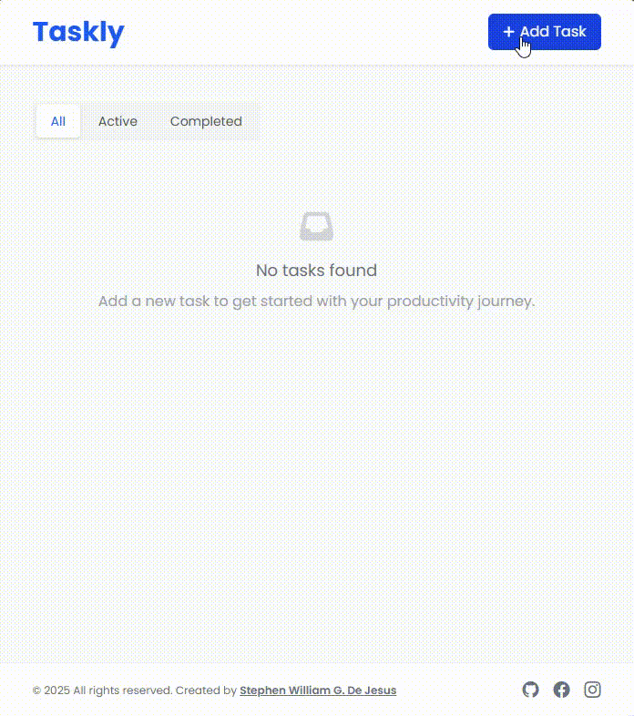

# ✅ Taskly — Simple Task Management App

A modern, intuitive, and accessible task management application built with **HTML5**, **Tailwind CSS**, and **JavaScript**.  
Add, edit, complete, and organize your daily tasks with a clean interface and persistent storage.

Crafted by **[Stephen William G. De Jesus](https://www.facebook.com/stephenwilliam.dejesus.5/)**, this project demonstrates CRUD operations, local storage implementation, and responsive design using Tailwind CSS.

---

## 📸 Preview  

### 🖼️ Application Screenshot  


### 🎞️ Live Interaction (GIF)  


---

## 🌐 Live Demo  
[View Live Demo](#) <!-- Replace # with your live link if available -->

---

## ✨ Features

- ➕ **Add Tasks** – Create new tasks with optional due dates
- ✏️ **Edit Tasks** – Modify existing task details inline
- ✅ **Complete Tasks** – Mark tasks as done with visual feedback
- 🗑️ **Delete Tasks** – Remove unwanted tasks with confirmation
- 🔍 **Filter Tasks** – View all, active, or completed tasks
- 💾 **Persistent Storage** – Tasks saved automatically in localStorage
- 📅 **Due Date Support** – Set and track task deadlines
- 📱 **Responsive Design** – Works perfectly on desktop, tablet, and mobile
- ♿ **Accessibility Ready** – ARIA labels, semantic HTML, and keyboard navigation
- 🎨 **Modern UI** – Clean design with Tailwind CSS and Font Awesome icons
- 🔔 **Smart Notifications** – Visual feedback for all user actions

---

## 🖥️ How to Use

1. **Add a Task** – Click the "Add Task" button and fill in the task details
2. **Set Due Date** – Optionally add a due date for better organization
3. **Mark Complete** – Check the checkbox to mark tasks as done
4. **Edit Tasks** – Click the pencil icon to modify task details
5. **Delete Tasks** – Click the trash icon to remove tasks
6. **Filter View** – Use tabs to view all, active, or completed tasks

---

## 🛠️ Built With

- [HTML5](https://developer.mozilla.org/en-US/docs/Web/Guide/HTML/HTML5) – Semantic structure
- [Tailwind CSS](https://tailwindcss.com/) – Utility-first styling
- [JavaScript ES6+](https://developer.mozilla.org/en-US/docs/Web/JavaScript) – Modern vanilla JavaScript
- [Font Awesome](https://fontawesome.com/) – Icons for UI elements
- [Bootstrap Icons](https://icons.getbootstrap.com/) – Additional icon library
- [Google Fonts (Poppins)](https://fonts.google.com/specimen/Poppins) – Typography

---

## 📁 Project Structure

```
19-javascript-task-management/
├── index.html              # Main HTML structure with semantic markup
├── script.js               # Core JavaScript functionality
├── output.css              # Compiled Tailwind CSS styles
└── images/
    ├── demo.png           # Application screenshot
    └── demo.gif           # Demo animation
```

---

## 🚀 Getting Started

To run this project locally:

```bash
git clone https://github.com/bogiiiie/19-javascript-task-management.git
cd 19-javascript-task-management
open index.html
```

**No build process required** – Just open `index.html` in your browser!

---

## 🎯 Core Functions

- `createTask(taskData)` – Creates new tasks with validation
- `updateTask(taskId, taskData)` – Updates existing task properties
- `deleteTask(taskId)` – Removes tasks with debouncing protection
- `toggleTaskStatus(taskId)` – Switches between active/completed states
- `renderTasks()` – Dynamically updates the task display
- `saveTasksToStorage()` – Persists data to localStorage
- `loadTasksFromStorage()` – Retrieves saved tasks on app load

---

## ♿ Accessibility Features

- **ARIA Labels** – Comprehensive labeling for screen readers
- **Semantic HTML** – Proper heading hierarchy and landmark roles
- **Keyboard Navigation** – Full keyboard support for all interactions
- **Focus Management** – Clear focus indicators and logical tab order
- **Screen Reader Support** – Hidden descriptions and status announcements
- **Color Contrast** – WCAG compliant color combinations

---

## 📱 Responsive Design

- **Mobile-First** – Optimized for small screens first
- **Flexible Layout** – Adapts to any screen size (320px to 2560px+)
- **Touch-Friendly** – Appropriately sized tap targets
- **Readable Typography** – Scalable fonts and proper line heights

---

## 💾 Data Persistence

- **localStorage Integration** – Tasks persist between browser sessions
- **Auto-Save** – Changes saved immediately without user action
- **Error Handling** – Graceful fallbacks for storage errors
- **Data Validation** – Input sanitization and type checking

---

## 🔧 Technical Features

- **Debounced Actions** – Prevents spam clicking and multiple submissions
- **Input Validation** – Client-side form validation with visual feedback
- **Error Boundaries** – Comprehensive error handling and user notifications
- **Performance Optimized** – Efficient DOM manipulation and event handling
- **Modern JavaScript** – ES6+ features with broad browser compatibility

---

## 🔧 Troubleshooting

### Common Issues

- **Tasks not saving:** Check if localStorage is enabled in your browser
- **Styles not loading:** Ensure `output.css` is in the same directory
- **JavaScript errors:** Check browser console for missing dependencies
- **Date picker issues:** Verify browser supports HTML5 date input

### Browser Support

- **Modern Browsers:** Chrome 60+, Firefox 55+, Safari 12+, Edge 79+
- **Mobile Browsers:** iOS Safari 12+, Chrome Mobile 60+

---

## 👨‍💻 Author

**Stephen William G. De Jesus**

- 🌐 **Facebook:** [Stephen William De Jesus](https://www.facebook.com/stephenwilliam.dejesus.5/)
- 💻 **GitHub:** [@bogiiiie](https://github.com/bogiiiie)
- 📸 **Instagram:** [@stephenwilliamdejesus](https://www.instagram.com/stephenwilliamdejesus/)

---

## 📄 License

© 2025 All rights reserved. Created by Stephen William G. De Jesus.

---

## 🚀 Future Enhancements

- 🏷️ **Task Categories** – Organize tasks with custom labels
- 🔍 **Search Functionality** – Find tasks quickly with keyword search  
- 📊 **Statistics Dashboard** – Track productivity metrics and trends
- 🌙 **Dark Mode** – Toggle between light and dark themes
- 🔄 **Task Sync** – Cloud storage integration for multi-device access
- ⏰ **Reminders** – Browser notifications for upcoming due dates
- 📤 **Export/Import** – Backup and restore task data
- 🎨 **Themes** – Customizable color schemes and layouts
- 📱 **PWA Support** – Install as a native-like mobile app

---
